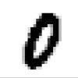
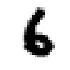
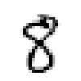

# Machine Learning workshop

In this workshop you will learn how to create an image recognizion machine learning algorithm using Python and Keras.

## Dataset

We will use the MNIST dataset during the workshop.

28x28 pictures of hand written digits.

    

## Environment

- Python 3.7+
- Keras as Machine Learning framework
- Python requirements can be installed with `pip` and the `requirements.txt` file.

## Setup

### Using Python

Make sure Python and pip are installed.

Install the required dependencies with:

```bash
pip install -r requirements.txt
```

You can then run your code using

```bash
python mnist.py
```

### Using Docker

You can use the provided Dockerfile which will run your script in a linux environment with all dependencies installed. This is the easiest way of running your code if you have Docker installed. I do not however know how much Docker will affect performance.

To run your code in Docker first build a image with

```bash
docker build -t mnist .
```

And then run the code with

```bash
docker run mnist
```

## Train a model to recognize digits

The file mnist.py contains a skeleton which needs to be completed. There are multiple ways of solving the problem. But a good start is making the Keras model compile. I.e. adjust the data and the layers of the network making the model run.

Then you need to dedice which loss function and optimizer you are going to use. If your model compiles and runs you will get an accuracy. Now starts the fun trying to improve your model.

The [keras documentation](https://keras.io/#getting-started-30-seconds-to-keras) are a good place to start.

### Improving your model

There are many techniques for improving your artifical neural network, and many parameters to tweak. Learning rate, nodes in layers, number of layers, optimizers, loss functions.

### Convolutional neural networks(CNN)

Until now you may only have used the Dense layer in your model. A very popular technique for image recognizion are CNNs.

Relevant layers to start with for creating a CNN are `Conv2D` and `Flatten`.

```python
from keras.layers import Dense, Conv2D, Flatten
```

### GAN

Why not generate your own unique handwritten digits, without drawing? Generative adversarial networks have become increasingly popular lately. And GANs are not too diffucult to create and train using Keras.

[Look at the GAN markdown file which consists images of what GAN contains.](./docs/GAN.md)

## Tips & tricks

- Does the network take a long time to train? What about letting the loss function look at multiple traning examples simultainously?

### Keras has it all

Theres is a lot of nice features and functions in Keras.

I would recommend taking a look at `keras.optimizers` or `keras.losses`. You could of course write your own loss function or optimizer, which would be a great exercise!

### Adjust the data

Your data is everything. Adjusting and tweaking the data can improve the result as well as make it easier to use.

Built-in functions which will be useful.

- `.reshape()` Can be used to reshape numpy matrices. [(Link to docs)](https://docs.scipy.org/doc/numpy/reference/generated/numpy.reshape.html)
- `.astype('float32)` Can be used to change type of values in numpy matrices. (Hint: if python sees an integer divided by an integer, you will not recieve a decimal number.)
- You will like this function -> `keras.utils.to_categorical`

### Visualization of the network/model

#### Display a single image from the dataset

```python
import keras
from keras.datasets import mnist
import matplotlib.pyplot as plt

image_index = 42
(x_train, y_train), (x_test, y_test) = mnist.load_data()
print("Label: " +  str(y_train[image_index]))
plt.imshow(x_train[image_index], cmap='Greys')
plt.show()
```

#### Textual visualization

```python
model.summary()
```

#### Generating a picture

```python
from keras.utils import plot_model
plot_model(model, to_file='model.png', show_shapes=True)
```

PS: Generating an image requires the following packages.

- pydot - `pip install pydot`
- graphviz - `brew install graphviz`
